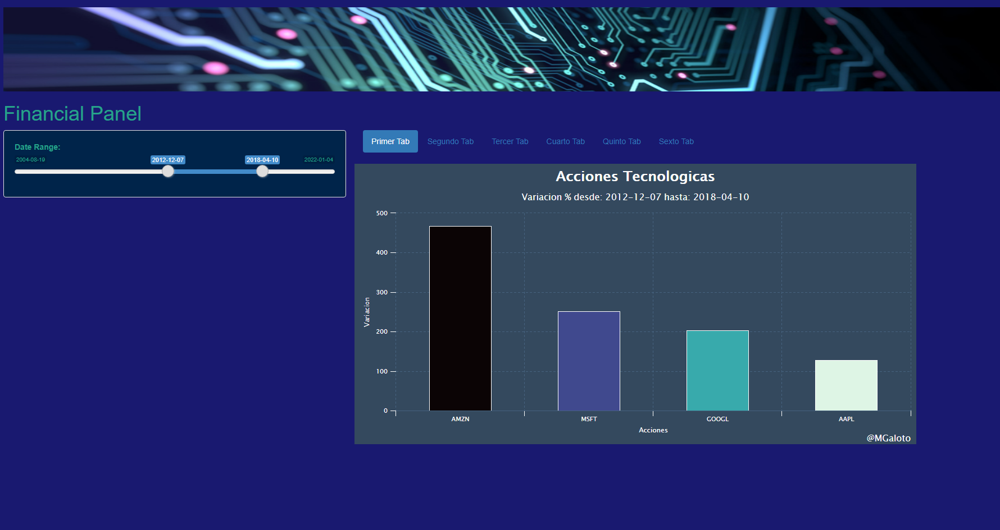

# shiny_data_science
Data Science Shiny App

Iniciando una aplicación Shiny con datos en Real Time

Se ajustaron los datos para que el gráfico de barras de 4 de las principales acciones del NASDAQ nos muestre la variación porcentual dentro del periodo deseado

El usuario podrá interactuar con un rango de fechas.

Libreria:

